```mermaid
graph TB
    subgraph "External Access"
        INTERNET[Internet]
        DNS[DNS/Load Balancer]
    end
    
    subgraph "Ingress Layer"
        INGRESS[Kubernetes Ingress / nginx]
        CERT[TLS Certificates]
    end
    
    subgraph "Load Balancer Layer"
        LB[NGINX Load Balancer]
        CONSUL_TEMPLATE[Consul Template]
    end
    
    subgraph "Service Discovery"
        CONSUL[Consul Cluster]
        SD_HEALTH[Health Checks]
    end
    
    subgraph "MCP Services (11 Services)"
        MCP1[Deployment MCP<br/>Port: 3001]
        MCP2[Flow Composer MCP<br/>Port: 3002]
        MCP3[Intelligent MCP<br/>Port: 3003]
        MCP4[Update Set MCP<br/>Port: 3004]
        MCP5[Graph Memory MCP<br/>Port: 3005]
        MCP6[Operations MCP<br/>Port: 3006]
        MCP7[Platform Dev MCP<br/>Port: 3007]
        MCP8[Integration MCP<br/>Port: 3008]
        MCP9[Automation MCP<br/>Port: 3009]
        MCP10[Security MCP<br/>Port: 3010]
        MCP11[Reporting MCP<br/>Port: 3011]
    end
    
    subgraph "Data Layer"
        REDIS[Redis Cache]
        NEO4J[Neo4j Graph DB]
        CONSUL_DATA[Consul Data]
    end
    
    subgraph "Monitoring Stack"
        PROMETHEUS[Prometheus]
        GRAFANA[Grafana]
        ALERTMANAGER[AlertManager]
    end
    
    subgraph "External Systems"
        SERVICENOW[ServiceNow Instance]
        EXTERNAL_APIS[External APIs]
    end
    
    INTERNET --> DNS
    DNS --> INGRESS
    INGRESS --> LB
    LB --> MCP1
    LB --> MCP2
    LB --> MCP3
    LB --> MCP4
    LB --> MCP5
    LB --> MCP6
    LB --> MCP7
    LB --> MCP8
    LB --> MCP9
    LB --> MCP10
    LB --> MCP11
    
    CONSUL_TEMPLATE -.-> CONSUL
    LB -.-> CONSUL_TEMPLATE
    
    MCP1 -.-> CONSUL
    MCP2 -.-> CONSUL
    MCP3 -.-> CONSUL
    MCP4 -.-> CONSUL
    MCP5 -.-> CONSUL
    MCP6 -.-> CONSUL
    MCP7 -.-> CONSUL
    MCP8 -.-> CONSUL
    MCP9 -.-> CONSUL
    MCP10 -.-> CONSUL
    MCP11 -.-> CONSUL
    
    MCP5 --> NEO4J
    MCP1 --> REDIS
    MCP2 --> REDIS
    MCP3 --> REDIS
    
    PROMETHEUS --> MCP1
    PROMETHEUS --> MCP2
    PROMETHEUS --> MCP3
    PROMETHEUS --> MCP4
    PROMETHEUS --> MCP5
    PROMETHEUS --> MCP6
    PROMETHEUS --> MCP7
    PROMETHEUS --> MCP8
    PROMETHEUS --> MCP9
    PROMETHEUS --> MCP10
    PROMETHEUS --> MCP11
    
    GRAFANA --> PROMETHEUS
    ALERTMANAGER --> PROMETHEUS
    
    MCP1 --> SERVICENOW
    MCP2 --> SERVICENOW
    MCP3 --> SERVICENOW
    MCP4 --> SERVICENOW
    MCP5 --> SERVICENOW
    MCP6 --> SERVICENOW
    MCP7 --> SERVICENOW
    MCP8 --> SERVICENOW
    MCP9 --> SERVICENOW
    MCP10 --> SERVICENOW
    MCP11 --> SERVICENOW
```

# ServiceNow MCP Services - Containerized Architecture

## 🏗️ Architecture Overview

This document describes the complete containerized deployment strategy for the 11 ServiceNow MCP (Model Context Protocol) servers, designed for high availability, scalability, and operational excellence.

## 📐 System Architecture



## 🐳 Container Architecture

### Core Components

#### 1. **MCP Services** (11 Microservices)
- **Deployment Strategy**: Each service runs as an independent container
- **Base Image**: Custom Node.js Alpine base with security hardening
- **Transport**: HTTP/REST instead of stdio for containerization
- **Health Checks**: Built-in health and readiness probes
- **Resource Management**: CPU and memory limits per service

#### 2. **Service Discovery** (Consul)
- **High Availability**: 3-node Consul cluster
- **Health Monitoring**: Automatic service registration/deregistration
- **Configuration Management**: Dynamic service configuration
- **DNS Integration**: Service discovery via DNS

#### 3. **Load Balancing** (NGINX)
- **Dynamic Configuration**: Consul-template driven upstreams
- **Health Checks**: Automatic failing service removal
- **SSL Termination**: TLS certificates with automatic renewal
- **Rate Limiting**: Per-service rate limiting and security headers

#### 4. **Data Layer**
- **Redis**: Session storage and caching
- **Neo4j**: Graph database for MCP Graph Memory service
- **Persistent Storage**: Data persistence with volume mounts

#### 5. **Monitoring Stack**
- **Prometheus**: Metrics collection and alerting
- **Grafana**: Dashboards and visualization
- **AlertManager**: Alert routing and notification

## 🚀 Deployment Strategies

### Development Environment (Docker Compose)

**Features:**
- Single-node deployment
- Volume mounts for live development
- Exposed ports for direct service access
- Debug logging enabled

**Usage:**
```bash
# Deploy development environment
./deploy.sh deploy

# Access services
curl http://localhost/health
curl http://localhost:3001/health  # Direct service access
```

### Staging Environment (Docker Compose + Production Config)

**Features:**
- Production-like resource limits
- SSL termination
- Limited external access
- Enhanced logging and monitoring

**Usage:**
```bash
# Deploy staging environment
ENVIRONMENT=staging ./deploy.sh deploy
```

### Production Environment (Kubernetes)

**Features:**
- High availability with multiple replicas
- Auto-scaling based on CPU/memory usage
- Persistent storage with backup strategies
- Network policies and security controls
- Ingress with TLS certificates

**Usage:**
```bash
# Deploy to production Kubernetes cluster
ENVIRONMENT=production ./deploy.sh deploy

# Monitor deployment
kubectl -n servicenow-mcp get pods
kubectl -n servicenow-mcp get services
```

## 📊 Scaling Strategy

### Horizontal Scaling

#### Automatic Scaling (Kubernetes HPA)
```yaml
Target CPU: 70%
Target Memory: 80%
Min Replicas: 2
Max Replicas: 6 (per service)
Scale Up: 50% increase per 60s
Scale Down: 25% decrease per 60s (5min stabilization)
```

#### Service-Specific Scaling
- **Intelligent MCP**: 3-9 replicas (high AI processing load)
- **Operations MCP**: 3-9 replicas (high availability critical)
- **Standard Services**: 2-6 replicas (standard workload)
- **Graph Memory MCP**: 2-4 replicas (memory intensive)

### Vertical Scaling

#### Resource Allocation by Service Type
```yaml
Standard Services (8 services):
  Requests: 250m CPU, 256Mi Memory
  Limits: 500m CPU, 512Mi Memory

High-Load Services (Intelligent, Operations):
  Requests: 500m CPU, 512Mi Memory
  Limits: 1000m CPU, 1Gi Memory

Memory-Intensive Services (Graph Memory, Reporting):
  Requests: 500m CPU, 512Mi Memory
  Limits: 1000m CPU, 1Gi Memory
```

## 🔐 Security Architecture

### Container Security
- **Non-root user**: All containers run as user ID 1001
- **Read-only filesystem**: Immutable container filesystem
- **Security scanning**: Automated vulnerability scanning
- **Resource limits**: CPU and memory constraints

### Network Security
- **Network policies**: Kubernetes network isolation
- **Service mesh**: Optional Istio integration for mTLS
- **TLS everywhere**: End-to-end encryption
- **Rate limiting**: DDoS protection at ingress layer

### Secret Management
- **Kubernetes secrets**: Encrypted secret storage
- **ServiceNow credentials**: OAuth token management
- **Certificate management**: Automatic cert renewal
- **Environment separation**: Isolated credentials per environment

## 📈 Monitoring and Observability

### Metrics Collection
- **Application metrics**: Custom MCP service metrics
- **Infrastructure metrics**: CPU, memory, disk, network
- **Business metrics**: ServiceNow API call success rates
- **Performance metrics**: Response times and throughput

### Alerting Rules
```yaml
Critical Alerts:
  - Service Down (> 1 minute)
  - High Error Rate (> 10% for 2 minutes)
  - Memory Usage (> 90% for 2 minutes)

Warning Alerts:
  - High CPU Usage (> 70% for 2 minutes)
  - High Response Time (> 5 seconds for 5 minutes)
  - Service Discovery Issues
```

### Dashboards
- **Service Overview**: All MCP services health status
- **Performance Dashboard**: Response times and throughput
- **Infrastructure Dashboard**: Resource utilization
- **Business Dashboard**: ServiceNow integration metrics

## 💾 Data Management

### Persistent Storage
```yaml
Consul Data: 10GB SSD
Redis Data: 20GB SSD  
Neo4j Data: 50GB SSD
Prometheus Data: 100GB SSD
Grafana Data: 10GB Standard
Log Storage: 50GB Standard
```

### Backup Strategy
- **Database backups**: Daily Neo4j and Redis snapshots
- **Configuration backups**: Consul KV store backups
- **Metric backups**: Long-term Prometheus storage
- **Disaster recovery**: Multi-region backup replication

## 🔄 CI/CD Integration

### Build Pipeline
1. **Code checkout**: Source code retrieval
2. **Security scanning**: Vulnerability and secret scanning
3. **Unit tests**: Service-specific testing
4. **Image building**: Multi-stage Docker builds
5. **Image scanning**: Container vulnerability assessment
6. **Registry push**: Secure image registry storage

### Deployment Pipeline
1. **Environment validation**: Target environment health
2. **Configuration management**: Environment-specific configs
3. **Blue-green deployment**: Zero-downtime deployments
4. **Health verification**: Post-deployment health checks
5. **Smoke tests**: Basic functionality verification
6. **Rollback capability**: Automatic rollback on failure

## 📚 Operations Guide

### Quick Start Commands

#### Development Environment
```bash
# Initial setup
git clone <repository>
cd servicenow_multiagent

# Configure environment
cp .env.example .env
# Edit .env with your ServiceNow credentials

# Deploy
./deploy.sh deploy

# View logs
./deploy.sh logs

# Stop deployment
./deploy.sh stop
```

#### Production Environment
```bash
# Ensure kubectl is configured for your cluster
kubectl cluster-info

# Deploy to production
ENVIRONMENT=production ./deploy.sh deploy

# Monitor deployment
kubectl -n servicenow-mcp get pods -w

# View service status
kubectl -n servicenow-mcp get services
```

### Troubleshooting

#### Common Issues

**1. Services not starting**
```bash
# Check logs
./deploy.sh logs

# For Kubernetes
kubectl -n servicenow-mcp logs <pod-name>

# Check resource constraints
kubectl -n servicenow-mcp describe pod <pod-name>
```

**2. Service discovery issues**
```bash
# Check Consul health
curl http://localhost:8500/v1/status/leader

# For Kubernetes
kubectl -n servicenow-mcp port-forward svc/consul 8500:8500
curl http://localhost:8500/v1/status/leader
```

**3. Load balancer issues**
```bash
# Check nginx configuration
docker exec <nginx-container> nginx -t

# View nginx logs
docker logs <nginx-container>
```

### Maintenance

#### Regular Maintenance Tasks
- **Weekly**: Review service metrics and performance
- **Monthly**: Update container images and security patches  
- **Quarterly**: Capacity planning and resource optimization
- **Annually**: Disaster recovery testing and backup validation

#### Health Checks
```bash
# Overall system health
./deploy.sh verify

# Individual service health
curl http://localhost:3001/health  # Deployment MCP
curl http://localhost:3002/health  # Flow Composer MCP
# ... (repeat for all services)
```

## 🎯 Performance Benchmarks

### Expected Performance (per service)
- **Response Time**: < 500ms (95th percentile)
- **Throughput**: 100 requests/second per replica
- **Memory Usage**: < 80% of allocated memory
- **CPU Usage**: < 70% of allocated CPU
- **Uptime**: 99.9% availability target

### Resource Requirements

#### Development Environment
- **CPU**: 8 cores minimum
- **Memory**: 16GB minimum
- **Storage**: 100GB minimum
- **Network**: 1Gbps

#### Production Environment  
- **CPU**: 32 cores (across cluster)
- **Memory**: 64GB (across cluster)
- **Storage**: 500GB SSD
- **Network**: 10Gbps with redundancy

## 🔗 Integration Endpoints

### Main API Gateway
- **Primary**: https://mcp.servicenow.local
- **Monitoring**: https://monitoring.servicenow.local
- **Direct Access**: https://direct.mcp.servicenow.local

### Service-Specific Endpoints
```yaml
Deployment MCP: /deployment-mcp/
Flow Composer MCP: /flow-composer-mcp/
Intelligent MCP: /intelligent-mcp/
Update Set MCP: /update-set-mcp/
Graph Memory MCP: /graph-memory-mcp/
Operations MCP: /operations-mcp/
Platform Development MCP: /platform-development-mcp/
Integration MCP: /integration-mcp/
Automation MCP: /automation-mcp/
Security Compliance MCP: /security-compliance-mcp/
Reporting Analytics MCP: /reporting-analytics-mcp/
```

## 📋 Migration Guide

### From Stdio to HTTP Transport
The containerized architecture replaces stdio-based MCP transport with HTTP/REST:

#### Before (stdio)
```javascript
const transport = new StdioServerTransport();
server.connect(transport);
```

#### After (HTTP)
```javascript
const httpWrapper = new HttpTransportWrapper(server, {
  name: 'service-name',
  port: 3001
});
await httpWrapper.start();
```

### Service Discovery Migration
Services now register automatically with Consul instead of manual configuration:

#### Automatic Registration
```javascript
await serviceDiscovery.register({
  name: 'deployment-mcp',
  address: process.env.SERVICE_IP,
  port: 3001,
  health: {
    http: `http://${process.env.SERVICE_IP}:3001/health`,
    interval: '10s'
  }
});
```

## 🏆 Benefits

### Operational Benefits
- **Scalability**: Horizontal and vertical scaling capabilities
- **Reliability**: High availability with automatic failover
- **Observability**: Comprehensive monitoring and alerting
- **Security**: Container isolation and secret management
- **Maintainability**: Standardized deployment and operations

### Development Benefits
- **Environment Parity**: Consistent dev/staging/production environments
- **Debugging**: Enhanced logging and direct service access
- **Testing**: Isolated testing environments
- **Integration**: Seamless CI/CD pipeline integration

### Business Benefits
- **Cost Optimization**: Resource efficiency and auto-scaling
- **Faster Time-to-Market**: Streamlined deployments
- **Reduced Risk**: Automated rollback and disaster recovery
- **Compliance**: Security and audit trail requirements

---

This containerized architecture provides a robust, scalable, and maintainable foundation for the ServiceNow MCP services, enabling efficient development, deployment, and operations across all environments.