# MCP Server Dependency Graph & Containerization Roadmap

## Visual Dependency Graph

```mermaid
graph TB
    %% Shared Infrastructure Layer
    subgraph "Shared Infrastructure"
        AUTH[shared-auth-service<br/>🔐 OAuth & API Keys]
        CONFIG[shared-config-service<br/>⚙️ Configuration]
        LOGS[shared-logging-service<br/>📊 Centralized Logging]
        GATEWAY[shared-api-gateway<br/>🚪 ServiceNow API Proxy]
    end

    %% Tier 1 - Foundation
    subgraph "Tier 1: Foundation Services"
        CORE[servicenow-mcp-server<br/>⭐ Core API<br/>🟢 EASY]
        UPDATE[servicenow-update-set-mcp<br/>⭐ Deployment Safety<br/>🟡 MEDIUM]
    end

    %% Tier 2 - Intelligence
    subgraph "Tier 2: Intelligence Layer"
        INTEL[servicenow-intelligent-mcp<br/>🧠 Discovery & Search<br/>🔴 HARD]
        DEPLOY[servicenow-deployment-mcp<br/>🚀 Advanced Deployment<br/>🔴 HARD]
    end

    %% Tier 3 - Domain Services
    subgraph "Tier 3: Domain Services"
        OPS[servicenow-operations-mcp<br/>🎯 Incidents & Requests<br/>🟢 EASY]
        PLATFORM[servicenow-platform-dev-mcp<br/>🔧 Scripts & UI<br/>🟢 EASY]
        AUTO[servicenow-automation-mcp<br/>⚡ Jobs & Events<br/>🟢 EASY]
        REPORT[servicenow-reporting-mcp<br/>📈 Analytics & Reports<br/>🟢 EASY]
        SECURITY[servicenow-security-mcp<br/>🛡️ Compliance & Audit<br/>🟡 MEDIUM]
        INTEGRATION[servicenow-integration-mcp<br/>🔗 External Systems<br/>🟡 MEDIUM]
    end

    %% Tier 4 - Specialized
    subgraph "Tier 4: Specialized Services"
        FLOW[servicenow-flow-composer-mcp<br/>🌊 Natural Language Flows<br/>🟡 MEDIUM]
        GRAPH[servicenow-graph-memory-mcp<br/>🕸️ Neo4j Graph Memory<br/>🔴 HARD]
        NEO4J[(Neo4j Database<br/>🗄️ External)]
    end

    %% Dependencies - Shared Infrastructure
    AUTH --> CORE
    AUTH --> UPDATE
    AUTH --> INTEL
    AUTH --> DEPLOY
    AUTH --> OPS
    AUTH --> PLATFORM
    AUTH --> AUTO
    AUTH --> REPORT
    AUTH --> SECURITY
    AUTH --> INTEGRATION
    AUTH --> FLOW
    AUTH --> GRAPH

    CONFIG --> CORE
    CONFIG --> UPDATE
    CONFIG --> INTEL
    CONFIG --> DEPLOY
    CONFIG --> OPS
    CONFIG --> PLATFORM
    CONFIG --> AUTO
    CONFIG --> REPORT
    CONFIG --> SECURITY
    CONFIG --> INTEGRATION
    CONFIG --> FLOW
    CONFIG --> GRAPH

    LOGS --> CORE
    LOGS --> UPDATE
    LOGS --> INTEL
    LOGS --> DEPLOY
    LOGS --> OPS
    LOGS --> PLATFORM
    LOGS --> AUTO
    LOGS --> REPORT
    LOGS --> SECURITY
    LOGS --> INTEGRATION
    LOGS --> FLOW
    LOGS --> GRAPH

    GATEWAY --> CORE
    GATEWAY --> UPDATE
    GATEWAY --> INTEL
    GATEWAY --> DEPLOY
    GATEWAY --> OPS
    GATEWAY --> PLATFORM
    GATEWAY --> AUTO
    GATEWAY --> REPORT
    GATEWAY --> SECURITY
    GATEWAY --> INTEGRATION
    GATEWAY --> FLOW
    GATEWAY --> GRAPH

    %% Service Dependencies
    CORE --> INTEL
    CORE --> DEPLOY
    UPDATE --> DEPLOY
    INTEL --> DEPLOY

    %% External Dependencies
    NEO4J --> GRAPH

    %% Styling
    classDef easy fill:#90EE90,stroke:#333,stroke-width:2px
    classDef medium fill:#FFD700,stroke:#333,stroke-width:2px
    classDef hard fill:#FF6B6B,stroke:#333,stroke-width:2px
    classDef shared fill:#E6E6FA,stroke:#333,stroke-width:2px
    classDef external fill:#FFA07A,stroke:#333,stroke-width:2px

    class CORE,OPS,PLATFORM,AUTO,REPORT easy
    class UPDATE,SECURITY,INTEGRATION,FLOW medium
    class INTEL,DEPLOY,GRAPH hard
    class AUTH,CONFIG,LOGS,GATEWAY shared
    class NEO4J external
```



## Deployment Sequence Matrix

| Phase | Week | Service | Complexity | Dependencies | Risk Level |
|-------|------|---------|------------|--------------|------------|
| 1 | 1-2 | **Shared Infrastructure** | - | None | LOW |
| | | └─ shared-auth-service | HIGH | None | MEDIUM |
| | | └─ shared-config-service | MEDIUM | None | LOW |
| | | └─ shared-logging-service | LOW | None | LOW |
| | | └─ shared-api-gateway | MEDIUM | Auth | MEDIUM |
| 2 | 3 | servicenow-mcp-server | 🟢 EASY | Shared Infra | LOW |
| 3 | 4 | **Domain Services (Parallel)** | - | Core + Shared | LOW |
| | | └─ servicenow-operations-mcp | 🟢 EASY | Core + Shared | LOW |
| | | └─ servicenow-platform-dev-mcp | 🟢 EASY | Core + Shared | LOW |
| | | └─ servicenow-automation-mcp | 🟢 EASY | Core + Shared | LOW |
| | | └─ servicenow-reporting-mcp | 🟢 EASY | Core + Shared | LOW |
| 4 | 5 | servicenow-update-set-mcp | 🟡 MEDIUM | Core + Shared + State | MEDIUM |
| 5 | 6-7 | **Medium Complexity** | - | Previous Tiers | MEDIUM |
| | | └─ servicenow-integration-mcp | 🟡 MEDIUM | Core + Shared | LOW |
| | | └─ servicenow-security-mcp | 🟡 MEDIUM | Core + Shared | LOW |
| | | └─ servicenow-flow-composer-mcp | 🟡 MEDIUM | Core + Shared | MEDIUM |
| 6 | 8-9 | servicenow-intelligent-mcp | 🔴 HARD | Core + Shared + Cache | HIGH |
| 7 | 10-11 | servicenow-deployment-mcp | 🔴 HARD | Update + Intel + Shared | HIGH |
| 8 | 12 | servicenow-graph-memory-mcp | 🔴 HARD | Neo4j + Shared | MEDIUM |

## Critical Path Analysis

### Must-Have Sequence (Cannot Parallelize)
```
1. Shared Infrastructure → 2. Core Server → 3. Update Set → 4. Intelligent → 5. Deployment
```

### Parallelizable Groups
```
Phase 3: All Domain Services can deploy simultaneously
Phase 5: Medium complexity services can deploy in parallel
```

### External Dependencies
- **Neo4j Database**: Required only for graph-memory service (optional)
- **ServiceNow Instance**: Required for all services (provided)
- **Redis/Cache**: Recommended for intelligent service (can be added)

## Resource Requirements

### Shared Infrastructure Cluster
```yaml
shared-auth-service:
  cpu: "500m"
  memory: "512Mi" 
  replicas: 3
  storage: "1Gi" # For session state

shared-config-service:
  cpu: "200m"
  memory: "256Mi"
  replicas: 2
  storage: "500Mi" # For config cache

shared-logging-service:
  cpu: "300m"
  memory: "1Gi"
  replicas: 2
  storage: "10Gi" # For log aggregation

shared-api-gateway:
  cpu: "1000m"
  memory: "1Gi"
  replicas: 3
  storage: "2Gi" # For rate limiting cache
```

### Service Resource Requirements
```yaml
# EASY Services (🟢)
easy-services:
  cpu: "200-500m"
  memory: "256-512Mi"
  replicas: 2
  storage: "100Mi"

# MEDIUM Services (🟡)  
medium-services:
  cpu: "500m-1000m"
  memory: "512Mi-1Gi"
  replicas: 2-3
  storage: "500Mi"

# HARD Services (🔴)
hard-services:
  cpu: "1000m-2000m"
  memory: "1-2Gi"
  replicas: 3-5
  storage: "1-5Gi"
```

## Success Validation Checklist

### Phase 1 - Infrastructure ✅
- [ ] Authentication service responds to OAuth requests
- [ ] Configuration service provides environment configs
- [ ] Logging service aggregates logs from test applications
- [ ] API gateway proxies requests to ServiceNow successfully

### Phase 2 - Core API ✅  
- [ ] Core server responds to basic MCP protocol requests
- [ ] Widget creation through HTTP endpoints works
- [ ] ServiceNow API connectivity confirmed

### Phase 3 - Domain Services ✅
- [ ] Each domain service independently handles requests
- [ ] No cross-service dependencies during operation
- [ ] All services register with service discovery

### Phase 4 - Update Set Management ✅
- [ ] Update set creation/switching works across services
- [ ] Session state persists across service restarts
- [ ] Deployment tracking functions properly

### Phase 5 - Medium Complexity ✅
- [ ] Integration service handles external API calls
- [ ] Security service performs compliance scans
- [ ] Flow composer generates valid ServiceNow flows

### Phase 6 - Intelligence Layer ✅
- [ ] Artifact discovery works with distributed caching
- [ ] Search performance meets SLA requirements
- [ ] Memory systems handle concurrent access

### Phase 7 - Advanced Deployment ✅
- [ ] Complex deployment workflows coordinate across services
- [ ] Rollback functionality works with distributed state
- [ ] Integration with intelligence and update-set services confirmed

### Phase 8 - Graph Memory ✅
- [ ] Neo4j integration functions properly
- [ ] Fallback mode works when Neo4j unavailable
- [ ] Graph analytics provide meaningful insights

## Monitoring & Observability Strategy

### Health Check Endpoints
```bash
# Infrastructure Health
curl -f http://auth-service:8080/health
curl -f http://config-service:8081/health
curl -f http://logging-service:8082/health
curl -f http://api-gateway:8083/health

# Service Health (Example)
curl -f http://servicenow-operations:3001/health
curl -f http://servicenow-deployment:3010/health
```

### Key Metrics to Monitor
1. **Authentication Service**: Token generation rate, failure rate
2. **API Gateway**: Request throughput, ServiceNow API rate limits
3. **Intelligence Service**: Cache hit ratio, search response time
4. **Deployment Service**: Success/failure rates, rollback frequency
5. **All Services**: Memory usage, CPU utilization, error rates

This comprehensive dependency graph and roadmap provides the structure needed to successfully extract and containerize all 11 MCP servers with clear dependencies, sequencing, and validation criteria.