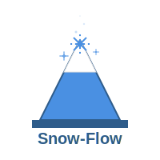

<div align="center">
  
  
  # ❄️ Snow-Flow v3.6.25 ❄️
  
  <p align="center">
    <strong>🚀 Revolutionary ServiceNow Development Framework with AI-Powered Automation</strong>
  </p>
  
  <p align="center">
    <a href="https://www.npmjs.com/package/snow-flow"></a>
    <a href="https://opensource.org/licenses/MIT"></a>
    <a href="https://nodejs.org"></a>
    <a href="https://github.com/groeimetai/snow-flow"></a>
  </p>

  <p align="center">
    <strong>18 MCP Servers</strong> • <strong>200+ Specialized Tools</strong> • <strong>100% Real Implementation</strong>
  </p>
</div>

---

## 🎉 What's New in v3.6.25

<div align="center">
  <table>
    <tr>
      <td align="center" width="50%">
        <h3>🚀 Major Features</h3>
        <ul align="left">
          <li><strong>Catalog UI Policy Deployment</strong><br/>Deploy via unified <code>snow_deploy</code> tool</li>
          <li><strong>Knowledge Base Verification</strong><br/>Prevents orphaned articles with strict validation</li>
          <li><strong>Catalog Variable Table Fix</strong><br/>Variables now use correct <code>item_option_new</code></li>
          <li><strong>Enhanced UI Policy Debugging</strong><br/>Comprehensive reference field debugging</li>
          <li><strong>18th MCP Server</strong><br/>Local Development Server for artifact syncing</li>
        </ul>
      </td>
      <td align="center" width="50%">
        <h3>🔧 Critical Fixes</h3>
        <ul align="left">
          <li>✅ Catalog variables now visible in ServiceNow</li>
          <li>✅ UI policy actions reference fields fixed</li>
          <li>✅ Non-existent KB error handling added</li>
          <li>✅ MCP transport 3x faster operations</li>
          <li>✅ Widget coherence validation improved</li>
        </ul>
      </td>
    </tr>
  </table>
</div>

## 📚 Table of Contents

<table>
  <tr>
    <td><a href="#-quick-start">⚡ Quick Start</a></td>
    <td><a href="#-installation">📦 Installation</a></td>
    <td><a href="#️-configuration">⚙️ Configuration</a></td>
    <td><a href="#-claude-code-setup">🤖 Claude Code Setup</a></td>
  </tr>
  <tr>
    <td><a href="#️-mcp-servers">🖥️ MCP Servers</a></td>
    <td><a href="#-usage-examples">💡 Usage Examples</a></td>
    <td><a href="#-commands">🔧 Commands</a></td>
    <td><a href="#️-troubleshooting">🛠️ Troubleshooting</a></td>
  </tr>
</table>

---

## ⚡ Quick Start

```bash
# Install Snow-Flow globally
npm install -g snow-flow

# Initialize in your project
snow-flow init

# Configure your ServiceNow instance
# Edit .env with your credentials

# Start using with Claude Code!
```

## 📦 Installation

<div align="center">
  <h3>📋 Prerequisites</h3>
  <table>
    <tr>
      <td align="center">🟢 Node.js 18+</td>
      <td align="center">📦 npm 9+</td>
      <td align="center">☁️ ServiceNow Instance</td>
      <td align="center">🤖 Claude Code Desktop</td>
    </tr>
  </table>
</div>

### Install from NPM

```bash
# Install globally
npm install -g snow-flow

# Verify installation
snow-flow --version
```

### Install from Source

```bash
# Clone repository
git clone https://github.com/groeimetai/snow-flow.git
cd snow-flow

# Install dependencies
npm install

# Build project
npm run build

# Link globally (optional)
npm link
```

## ⚙️ Configuration

### Step 1: Initialize Snow-Flow

```bash
# Create project directory
mkdir my-servicenow-project
cd my-servicenow-project

# Initialize Snow-Flow
snow-flow init
```

<details>
<summary><strong>📁 Created Files & Directories</strong></summary>

| File/Directory | Purpose |
|----------------|----------|
| `.env` | ServiceNow credentials |
| `.snow-flow/` | Configuration directory |
| `.claude/` | MCP server configurations |
| `CLAUDE.md` | Comprehensive documentation |
| `.mcp.json` | MCP server registry |

</details>

### Step 2: Configure ServiceNow Credentials

Edit the `.env` file with your ServiceNow instance details:

```env
# ServiceNow Instance Configuration
SNOW_INSTANCE=your-instance.service-now.com
SNOW_USERNAME=admin.username
SNOW_PASSWORD=admin.password

# OAuth Configuration (recommended for production)
SNOW_CLIENT_ID=your-oauth-client-id
SNOW_CLIENT_SECRET=your-oauth-client-secret
```

### Step 3: Verify Configuration

```bash
# Test connection
snow-flow test-connection

# Check MCP server status
snow-flow mcp status
```

## 🤖 Claude Code Setup

### Fix Permission Errors

**IMPORTANT:** If you encounter "dangerously skip permissions" errors in Claude Code, you must first authenticate with Claude:

```bash
# 1. First, login to Claude (required for MCP servers to work)
claude login

# 2. Then start Claude Code with MCP servers
claude --mcp-config .claude/claude_desktop_config.json
```

The `claude login` step is crucial - without it, MCP servers cannot authenticate with ServiceNow.

### Automatic MCP Server Activation

During `snow-flow init`, you'll be prompted to automatically activate all MCP servers:

```bash
🚀 Would you like to start Claude Code with MCP servers? (Y/n)
```

Selecting **Y** will:
- Configure all 18 MCP servers
- Auto-approve server permissions
- Launch Claude Code with servers ready

### Manual MCP Server Activation

If you need to manually activate MCP servers:

```bash
# Mac/Linux
claude --mcp-config .claude/claude_desktop_config.json

# Windows
claude.exe --mcp-config .claude/claude_desktop_config.json
```

## 🖥️ MCP Servers

<div align="center">
  <h3>🎯 18 Specialized MCP Servers • 200+ Tools • Complete ServiceNow Coverage</h3>
</div>

<details>
<summary><strong>🚀 Click to see all 18 MCP Servers and their capabilities</strong></summary>

### 1️⃣ **Deployment Server** (10 tools)
🎯 **Purpose:** Widget and artifact deployment with coherence validation

| Tool | Description |
|------|-------------|
| `snow_deploy` | Create new artifacts with support for 15+ types including `catalog_ui_policy` |
| `snow_update` | Update existing artifacts with validation |
| `snow_delete` | Delete artifacts safely |
| `snow_validate_deployment` | Pre-deployment validation |
| `snow_rollback_deployment` | Rollback failed deployments |
| `snow_preview_widget` | Preview widget before deployment |
| `snow_widget_test` | Test widget functionality |
| `snow_deployment_status` | Get deployment status |
| `snow_deployment_debug` | Debug deployment issues |

### 2️⃣ **Operations Server** (15+ tools)
🎯 **Purpose:** Core ServiceNow operations and queries

| Tool | Description |
|------|-------------|
| `snow_query_table` | Universal table querying with pagination |
| `snow_create_incident` | Create and manage incidents |
| `snow_update_record` | Update any table record |
| `snow_delete_record` | Delete records with validation |
| `snow_discover_table_fields` | Discover table schema |
| `snow_cmdb_search` | Search Configuration Management Database |
| `snow_user_lookup` | Find users and groups |
| `snow_operational_metrics` | Get operational metrics |
| `snow_knowledge_search` | Search knowledge base |

### 3️⃣ **Automation Server** (20+ tools)
🎯 **Purpose:** Script execution and automation

| Tool | Description |
|------|-------------|
| `snow_execute_script_with_output` | Execute scripts with full output capture |
| `snow_execute_background_script` | Execute background scripts with autoConfirm option |
| `snow_get_script_output` | Retrieve script execution history |
| `snow_get_logs` | Access system logs |
| `snow_test_rest_connection` | Test REST integrations |
| `snow_trace_execution` | Trace script execution |
| `snow_schedule_job` | Create scheduled jobs |
| `snow_create_event` | Trigger system events |

### 4️⃣ **Platform Development Server** (12+ tools)
🎯 **Purpose:** Platform development artifacts

| Tool | Description |
|------|-------------|
| `snow_create_script_include` | Create reusable scripts |
| `snow_create_business_rule` | Create business rules |
| `snow_create_client_script` | Create client-side scripts |
| `snow_create_ui_policy` | Create UI policies |
| `snow_create_ui_action` | Create UI actions |
| `snow_create_ui_page` | Create UI pages |

### 5️⃣ **Integration Server** (10+ tools)
🎯 **Purpose:** Integration and data management

| Tool | Description |
|------|-------------|
| `snow_create_rest_message` | Create REST integrations |
| `snow_create_transform_map` | Create data transformation maps |
| `snow_create_import_set` | Manage import sets |
| `snow_test_web_service` | Test web services |
| `snow_configure_email` | Configure email settings |

### 6️⃣ **System Properties Server** (12 tools)
🎯 **Purpose:** System property management

| Tool | Description |
|------|-------------|
| `snow_property_get` | Retrieve property values |
| `snow_property_set` | Set property values |
| `snow_property_list` | List properties by pattern |
| `snow_property_delete` | Remove properties |
| `snow_property_bulk_update` | Bulk operations |
| `snow_property_export` | Export to JSON |
| `snow_property_import` | Import from JSON |

### 7️⃣ **Update Set Server** (6 tools)
🎯 **Purpose:** Change management and deployment

| Tool | Description |
|------|-------------|
| `snow_update_set_create` | Create new update sets |
| `snow_update_set_switch` | Switch active update set |
| `snow_update_set_complete` | Mark as complete |
| `snow_update_set_export` | Export as XML |
| `snow_ensure_active_update_set` | Ensure update set is active |

### 8️⃣ **Development Assistant Server** (8+ tools)
🎯 **Purpose:** Intelligent artifact search and management

| Tool | Description |
|------|-------------|
| `snow_find_artifact` | Find any ServiceNow artifact |
| `snow_edit_artifact` | Edit existing artifacts |
| `snow_get_by_sysid` | Get artifact by sys_id |
| `snow_analyze_artifact` | Analyze dependencies |
| `snow_comprehensive_search` | Deep search across tables |

### 9️⃣ **Security & Compliance Server** (10+ tools)
🎯 **Purpose:** Security and compliance management

| Tool | Description |
|------|-------------|
| `snow_create_security_policy` | Create security policies |
| `snow_audit_compliance` | Compliance auditing |
| `snow_scan_vulnerabilities` | Vulnerability scanning |
| `snow_review_access_control` | ACL review |

### 🔟 **Reporting & Analytics Server** (10+ tools)
🎯 **Purpose:** Reporting and data visualization

| Tool | Description |
|------|-------------|
| `snow_create_report` | Create reports |
| `snow_create_dashboard` | Create dashboards |
| `snow_define_kpi` | Define KPIs |
| `snow_schedule_report` | Schedule report delivery |

### 1️⃣1️⃣ **Machine Learning Server** (10+ tools)
🎯 **Purpose:** AI/ML capabilities with TensorFlow.js

| Tool | Description |
|------|-------------|
| `ml_train_incident_classifier` | Train incident classifier |
| `ml_predict_change_risk` | Predict change risks |
| `ml_detect_anomalies` | Anomaly detection |
| `ml_forecast_incidents` | Incident forecasting |

### 1️⃣2️⃣ **Knowledge & Catalog Server** (15+ tools)
🎯 **Purpose:** Knowledge base and service catalog management

| Tool | Description |
|------|-------------|
| `snow_create_knowledge_article` | Create knowledge articles with KB validation |
| `snow_search_knowledge` | Search knowledge base |
| `snow_create_catalog_item` | Create catalog items |
| `snow_create_catalog_variable` | Create catalog variables in correct table |
| `snow_create_catalog_ui_policy` | Create UI policies with full support |
| `snow_order_catalog_item` | Order catalog items |

### 1️⃣3️⃣ **Change, Virtual Agent & PA Server** (15+ tools)
🎯 **Purpose:** Change management, Virtual Agent, and Performance Analytics

| Tool | Description |
|------|-------------|
| `snow_create_change_request` | Create change requests |
| `snow_schedule_cab_meeting` | Schedule CAB meetings |
| `snow_create_va_topic` | Create Virtual Agent topics |
| `snow_create_pa_indicator` | Create PA indicators |

### 1️⃣4️⃣ **Flow, Workspace & Mobile Server** (12+ tools)
🎯 **Purpose:** Flow Designer, Workspace, and Mobile management

| Tool | Description |
|------|-------------|
| `snow_list_flows` | List Flow Designer flows |
| `snow_execute_flow` | Execute flows programmatically |
| `snow_create_workspace` | Create workspaces |
| `snow_configure_mobile_app` | Configure mobile app |

### 1️⃣5️⃣ **CMDB, Event, HR, CSM & DevOps Server** (20+ tools)
🎯 **Purpose:** CMDB, Events, HR, Customer Service, DevOps

| Tool | Description |
|------|-------------|
| `snow_create_ci` | Create Configuration Items |
| `snow_create_event` | Create events |
| `snow_create_hr_case` | Create HR cases |
| `snow_create_customer_case` | Create customer cases |
| `snow_create_devops_pipeline` | Create DevOps pipelines |

### 1️⃣6️⃣ **Advanced Features Server** (15+ tools)
🎯 **Purpose:** Advanced optimization and analysis

| Tool | Description |
|------|-------------|
| `snow_batch_api` | Batch API operations (80% reduction) |
| `snow_analyze_query` | Query optimization |
| `snow_detect_code_patterns` | Code pattern detection |
| `snow_generate_documentation` | Auto-documentation |

### 1️⃣7️⃣ **Local Development Server** (10+ tools)
🎯 **Purpose:** Bridge between ServiceNow and Claude Code

| Tool | Description |
|------|-------------|
| `snow_pull_artifact` | Pull artifacts to local files |
| `snow_push_artifact` | Push changes back with validation |
| `snow_validate_artifact_coherence` | Validate relationships |
| `snow_convert_to_es5` | Convert modern JS to ES5 |

### 1️⃣8️⃣ **Snow-Flow Orchestration Server** (8 tools)
🎯 **Purpose:** Multi-agent coordination and task management

| Tool | Description |
|------|-------------|
| `swarm_init` | Initialize agent swarms |
| `agent_spawn` | Create specialized agents |
| `task_orchestrate` | Orchestrate complex tasks |
| `memory_search` | Search persistent memory |
| `neural_train` | Train neural networks (TensorFlow.js) |
| `performance_report` | Generate performance reports |

</details>

## 💡 Usage Examples

### 🔍 Basic Queries

```javascript
// Query any table
await snow_query_table({
  table: 'incident',
  query: 'active=true^priority=1',
  fields: ['number', 'short_description', 'assigned_to'],
  limit: 10
});

// Find users
await snow_user_lookup({
  name: 'John Doe',
  include_groups: true
});
```

### 🎯 Widget Deployment

```javascript
// Deploy new widget
await snow_deploy({
  type: 'widget',
  config: {
    name: 'my_dashboard',
    title: 'My Dashboard',
    template: '<div>{{data.message}}</div>',
    server_script: 'data.message = "Hello World";',
    client_script: 'function($scope) { var c = this; }'
  }
});
```

### 📦 Script Execution

```javascript
// Execute script with output capture
await snow_execute_script_with_output({
  script: `
    var count = new GlideAggregate('incident');
    count.addQuery('active', true);
    count.query();
    if (count.next()) {
      gs.info('Active incidents: ' + count.getAggregate('COUNT'));
    }
  `
});
```

### 📖 Knowledge Management

```javascript
// Create knowledge article with KB validation
await snow_create_knowledge_article({
  kb_knowledge_base: 'IT Knowledge Base',
  short_description: 'How to reset password',
  text: 'Step-by-step guide...',
  keywords: ['password', 'reset', 'security']
});
```

### 🛒 Catalog Management

```javascript
// Create catalog item with variables
await snow_create_catalog_item({
  name: 'New Laptop Request',
  category: 'Hardware',
  short_description: 'Request a new laptop'
});

// Create catalog UI policy
await snow_deploy({
  type: 'catalog_ui_policy',
  config: {
    catalog_item: 'item_sys_id',
    short_description: 'Manager Approval Required',
    conditions: [{
      catalog_variable: 'cost',
      operation: 'greater_than',
      value: '1000'
    }],
    actions: [{
      catalog_variable: 'manager_approval',
      type: 'set_mandatory',
      mandatory: true
    }]
  }
});
```

## 🔧 Commands

<details>
<summary><strong>🚀 Core System Commands</strong></summary>

### Core System
- `snow-flow start` - Start orchestration system
- `snow-flow status` - Show comprehensive system status
- `snow-flow monitor` - Real-time monitoring dashboard
- `snow-flow test-connection` - Test ServiceNow connection

### MCP Management
- `snow-flow mcp start` - Start MCP servers
- `snow-flow mcp status` - Show MCP server status
- `snow-flow mcp tools` - List available MCP tools

### Configuration
- `snow-flow init` - Initialize Snow-Flow project
- `snow-flow config show` - Show current configuration
- `snow-flow config set <key> <value>` - Set configuration value

### Development
- `snow-flow agent spawn <type>` - Create AI agents
- `snow-flow task create` - Create tasks
- `snow-flow memory store <key> <data>` - Store persistent data

### Orchestration
- `snow-flow swarm "<objective>"` - Multi-agent coordination
- `snow-flow sparc "<task>"` - SPARC mode orchestration
- `snow-flow sparc tdd "<feature>"` - Test-driven development

</details>

## 🛠️ Troubleshooting

<details>
<summary><strong>🆘 Common Issues & Solutions</strong></summary>

### Common Issues

**Permission Errors**
```bash
Error: "dangerously skip permissions"
Solution: Run 'claude login' before starting Claude Code
```

**Connection Failed**
```bash
Error: "Unable to connect to ServiceNow"
Solution: Check .env credentials and instance URL
```

**MCP Server Not Found**
```bash
Error: "MCP server not responding"
Solution: Restart Claude Code with --mcp-config flag
```

**Large Widget Errors**
```bash
Error: "Content exceeds maximum allowed tokens"
Solution: Use snow_pull_artifact instead of snow_query_table
```

### Debugging Tips

1. **Check Logs**
   ```bash
   # View MCP server logs
   tail -f .snow-flow/logs/mcp-*.log
   ```

2. **Test Connection**
   ```bash
   # Verify ServiceNow connectivity
   snow-flow test-connection
   ```

3. **Validate Configuration**
   ```bash
   # Check all settings
   snow-flow config validate
   ```

### Getting Help

- GitHub Issues: [https://github.com/groeimetai/snow-flow/issues](https://github.com/groeimetai/snow-flow/issues)
- Documentation: Run `snow-flow --help`
- MCP Server Logs: Check `.snow-flow/logs/`

</details>

## 📄 License

<div align="center">
  <p>MIT License. See <a href="LICENSE">LICENSE</a> file for details.</p>
  <p>Made with ❤️ by the Snow-Flow Team</p>
  <br/>
  <p>
    <a href="https://github.com/groeimetai/snow-flow">GitHub</a> •
    <a href="https://www.npmjs.com/package/snow-flow">NPM</a> •
    <a href="https://groeimetai.github.io/snow-flow/">Documentation</a>
  </p>
</div>