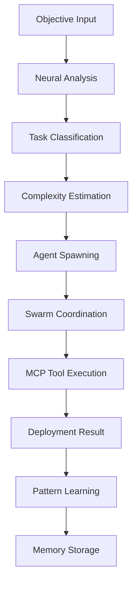

# ServiceNow Queen Agent 🐝

> **Hive-Mind Intelligence for ServiceNow Development**
> 
> A single coordination point that spawns specialized agents dynamically, learns from deployments, and orchestrates complex ServiceNow tasks with elegance through simplicity.

## ⚠️ IMPORTANT: Flow Creation Removed in v1.4.38 ⚠️

**Note**: All flow-related functionality has been permanently removed from Snow-Flow. Please use ServiceNow's native Flow Designer interface directly for flow creation. All other agent types and functionality continue to work normally.

## Philosophy: Claude-Flow Principles

The ServiceNow Queen Agent follows snow-flow philosophy:

- **🎯 Single Coordination Point**: All tasks go through the Queen
- **⚡ Dynamic Agent Spawning**: Creates agents based on task needs, not pre-defined teams  
- **🧠 Hive-Mind Intelligence**: Coordinates multiple agents seamlessly with shared memory
- **💾 Simple Memory**: Uses SQLite for persistent learning across sessions
- **📚 Neural Learning**: Learns from past deployments and adapts patterns

## Architecture

```
ServiceNow Queen Agent
├── 🐝 ServiceNowQueen (Main Coordinator)
├── 🏭 AgentFactory (Dynamic Agent Spawning)  
├── 💾 QueenMemorySystem (SQLite Persistence)
├── 🧠 NeuralLearning (Pattern Recognition)
└── 🔧 Agent Types (8 Specialized Agents)
```

## Quick Start

```typescript
import { createServiceNowQueen } from './queen';

// Create Queen with hive-mind intelligence
const queen = createServiceNowQueen({
  debugMode: true,
  maxConcurrentAgents: 5
});

// Execute any ServiceNow objective - Queen handles everything
const result = await queen.executeObjective(
  "create incident dashboard with real-time charts and mobile responsiveness"
);

console.log('✅ Deployment completed:', result);
```

## Core Components

### 1. ServiceNow Queen (Main Coordinator)

The central intelligence that:
- Analyzes objectives using neural learning
- Spawns optimal agent swarms dynamically
- Coordinates execution with MCP tools
- Learns from success/failure patterns

```typescript
const queen = new ServiceNowQueen({
  memoryPath: './.snow-flow/queen-memory.db',
  maxConcurrentAgents: 8,
  learningRate: 0.1,
  debugMode: true
});

// One command does everything
await queen.executeObjective("create incident dashboard widget with real-time updates");
```

### 2. Dynamic Agent Factory

Spawns specialized agents on-demand based on task analysis:

```typescript
// 8 Available Agent Types
- widget-creator     → HTML, CSS, JS, ServiceNow widgets
- script-writer      → Business rules, script includes, client scripts
- app-architect      → System design, table structures, modules
- integration-specialist → APIs, data sync, external systems
- catalog-manager    → Service catalog, request items, variables
- researcher         → Analysis, discovery, best practices  
- tester            → Quality assurance, mock testing, validation
```

### 3. Persistent Memory System

Simple SQLite-based learning that persists across sessions:

```sql
-- Stores successful deployment patterns
CREATE TABLE patterns (
  task_type TEXT,
  success_rate REAL,
  agent_sequence TEXT,
  avg_duration INTEGER
);

-- Remembers created artifacts
CREATE TABLE artifacts (
  type TEXT,
  name TEXT, 
  sys_id TEXT,
  dependencies TEXT
);

-- Learns from experiences
CREATE TABLE learnings (
  key TEXT,
  value TEXT,
  confidence REAL
);
```

### 4. Neural Learning Engine

Pattern recognition that improves over time:

- **Task Classification**: Widget vs Script vs Application
- **Complexity Estimation**: Based on keyword analysis and learned weights
- **Agent Selection**: Optimal sequence based on successful patterns
- **Success/Failure Learning**: Adjusts confidence weights dynamically

## Execution Flow



## Usage Examples

### Simple Widget Creation

```typescript
await queen.executeObjective("create incident dashboard");

// Queen automatically:
// 1. Classifies as 'widget' task
// 2. Spawns: widget-creator → tester
// 3. Generates HTML, CSS, JS code
// 4. Deploys using snow_deploy MCP tool
// 5. Learns from success for future widget tasks
```

### Complex Widget with Integration

```typescript
await queen.executeObjective(
  "create equipment request dashboard with external API integration"
);

// Queen automatically:
// 1. Classifies as 'widget' task (high complexity)
// 2. Spawns: researcher → widget-creator → integration-specialist → tester  
// 3. Coordinates sequential execution with agent communication
// 4. Uses snow_deploy + snow_create_rest_message
// 5. Learns optimal agent sequence for similar future tasks
```

### Application Development

```typescript
await queen.executeObjective(
  "build complete ITSM solution with custom tables and workflows"
);

// Queen automatically:
// 1. Classifies as 'application' task (very high complexity)
// 2. Spawns: researcher → app-architect → script-writer → widget-creator → tester
// 3. Coordinates with shared memory between agents
// 4. Uses multiple MCP tools in optimal sequence
// 5. Stores deployment pattern for future application tasks
```

## Learning & Adaptation

The Queen learns from every deployment:

### Success Patterns
```typescript
// Queen remembers successful patterns
{
  taskType: 'widget',
  successRate: 0.92,
  agentSequence: ['widget-creator', 'tester'],
  avgDuration: 45000,
  mcpSequence: ['snow_deploy', 'snow_widget_test']
}
```

### Failure Recovery
```typescript
// Queen learns from failures and adapts
queen.learnFromFailure(task, 'Permission denied', ['widget-creator']);
// Next time: adds 'researcher' to check permissions first
```

### Neural Weight Adjustment
```typescript
// Adjusts confidence in complexity factors
{
  factor: 'chart_integration',
  weight: 0.3,
  confidence: 0.9  // High confidence after successful chart deployments
}
```

## Agent Coordination

### Parallel Execution
Independent agents (researcher, tester, script-writer) run simultaneously:

```typescript
// Parallel execution for speed
const results = await Promise.all([
  researcherAgent.execute(),
  testerAgent.execute(),
  scriptAgent.execute()
]);
```

### Sequential Coordination
Dependent agents execute in optimal sequence:

```typescript
// Sequential with shared context
researcher → widget-creator → tester
//           ↓ shares findings ↓
//        widget-creator uses research
//                          ↓ receives widget
//                       tester validates
```

### Message Passing
Agents communicate through the Queen:

```typescript
// Agent coordination
this.agentFactory.sendAgentMessage(
  fromAgent: 'researcher',
  toAgent: 'widget-creator', 
  type: 'result',
  content: { findings: '...', recommendations: '...' }
);
```

## Memory Management

### Artifact Tracking
```typescript
// Stores all created artifacts
queen.memory.storeArtifact({
  type: 'widget',
  name: 'incident_dashboard_widget', 
  sys_id: 'abc123...',
  config: { /* widget config */ },
  dependencies: ['Chart.js library']
});
```

### Pattern Reuse
```typescript
// Reuses successful patterns
const bestPattern = queen.memory.getBestPattern('widget');
if (bestPattern.successRate > 0.8) {
  // Use proven agent sequence
  agents = spawnAgents(bestPattern.agentSequence);
}
```

### Cross-Session Learning
```typescript
// Persistent learning across sessions
queen.memory.storeLearning(
  'widget_chart_integration',
  'Always include Chart.js for dashboard widgets',
  confidence: 0.95
);
```

## Status & Monitoring

```typescript
// Real-time hive-mind status
const status = queen.getHiveMindStatus();
console.log(status);
/*
{
  activeTasks: 2,
  activeAgents: 5,
  memoryStats: {
    patterns: 24,
    artifacts: 156,
    learnings: 89
  },
  factoryStats: {
    totalActiveAgents: 5,
    agentTypeCounts: { 'widget-creator': 2, 'tester': 1 }
  }
}
*/
```

## Integration with Existing MCP Tools

The Queen uses existing MCP servers as "tools" for agents:

```typescript
// Widget agents use these MCP tools:
- snow_deploy (unified deployment)
- snow_preview_widget
- snow_widget_test

// Script agents use these MCP tools:  
- snow_create_script_include
- snow_create_business_rule
- snow_create_client_script

// All agents coordinate through Queen
```

## Advantages Over Team System

| Old Team System | New Queen System |
|-----------------|------------------|
| 🐌 Pre-defined teams | ⚡ Dynamic agent spawning |
| 🔧 Fixed capabilities | 🎯 Task-optimized agents |
| 📋 Manual coordination | 🤖 Autonomous hive-mind |
| 💾 No learning | 🧠 Continuous adaptation |
| 🔄 Complex orchestration | ✨ Elegant simplicity |

## Configuration

```typescript
const queen = new ServiceNowQueen({
  // Memory persistence
  memoryPath: './.snow-flow/queen/memory.db',
  
  // Agent management
  maxConcurrentAgents: 8,
  
  // Learning parameters
  learningRate: 0.1,
  
  // Development mode
  debugMode: process.env.NODE_ENV === 'development'
});
```

## Export & Backup

```typescript
// Export all learned patterns and memories
const backup = queen.exportMemory();
fs.writeFileSync('queen-backup.json', backup);

// Queen automatically creates SQLite backups
// .snow-flow/queen/memory.db
```

## Philosophy in Action

The Queen embodies **snow-flow principles**:

### 1. Elegance through Simplicity
- **One entry point**: `queen.executeObjective()`
- **No complex configuration**: Works out of the box
- **Natural language**: "create incident dashboard" → complete deployment

### 2. Intelligence through Learning
- **Remembers what works**: Successful patterns are reused
- **Adapts to failures**: Learns from errors and adjusts
- **Improves over time**: Gets better with each deployment

### 3. Coordination through Simplicity
- **No manual orchestration**: Agents coordinate automatically
- **Clear responsibilities**: Each agent type has focused capabilities
- **Simple communication**: Message passing through Queen

## Future Evolution

The Queen will evolve while maintaining simplicity:

- **🔌 MCP Tool Integration**: Deeper integration with all ServiceNow MCPs
- **🎯 Specialized Agents**: New agent types for specific ServiceNow domains
- **🧠 Advanced Learning**: More sophisticated pattern recognition
- **⚡ Performance Optimization**: Faster agent spawning and coordination
- **🔐 Security Integration**: Security-aware deployment patterns

---

*Built with ❤️ following snow-flow philosophy: Elegance through simplicity, intelligence through learning.*