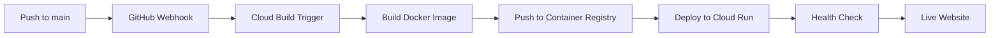

# Snow-Flow Website - Google Cloud Build Setup Guide 🚀

Complete setup guide for automated CI/CD deployment to Google Cloud Run.

## 📋 Prerequisites

1. **Google Cloud Project** with billing enabled
2. **GitHub Repository** (groeimetai/snow-flow)
3. **Google Cloud CLI** installed locally

## 🔧 Step 1: Enable APIs

```bash
# Set your project ID
export PROJECT_ID="your-project-id"
gcloud config set project $PROJECT_ID

# Enable required APIs
gcloud services enable cloudbuild.googleapis.com
gcloud services enable run.googleapis.com
gcloud services enable containerregistry.googleapis.com
gcloud services enable artifactregistry.googleapis.com
```

## 🔑 Step 2: Configure IAM Permissions

```bash
# Get the Cloud Build service account
export CLOUDBUILD_SA="$(gcloud projects describe $PROJECT_ID --format='value(projectNumber)')@cloudbuild.gserviceaccount.com"

# Grant Cloud Run Developer role
gcloud projects add-iam-policy-binding $PROJECT_ID \
  --member="serviceAccount:$CLOUDBUILD_SA" \
  --role="roles/run.developer"

# Grant Service Account User role  
gcloud projects add-iam-policy-binding $PROJECT_ID \
  --member="serviceAccount:$CLOUDBUILD_SA" \
  --role="roles/iam.serviceAccountUser"

# Grant Storage Admin role (for Container Registry)
gcloud projects add-iam-policy-binding $PROJECT_ID \
  --member="serviceAccount:$CLOUDBUILD_SA" \
  --role="roles/storage.admin"
```

## 🔗 Step 3: Connect GitHub Repository

### Option A: Google Cloud Console (Recommended)

1. Go to [Cloud Build Triggers](https://console.cloud.google.com/cloud-build/triggers)
2. Click **"Connect Repository"**
3. Select **"GitHub (Cloud Build GitHub App)"**
4. Authenticate with GitHub
5. Select repository: **groeimetai/snow-flow**
6. Click **"Connect"**

### Option B: Command Line

```bash
# Install the GitHub App first (requires manual step in browser)
gcloud alpha builds triggers connect github \
  --repo-name=snow-flow \
  --repo-owner=groeimetai
```

## ⚡ Step 4: Create Build Trigger

### Using Google Cloud Console

1. Go to [Cloud Build Triggers](https://console.cloud.google.com/cloud-build/triggers)
2. Click **"Create Trigger"**
3. Configure:
   - **Name:** `snow-flow-website-deploy`
   - **Description:** `Deploy Snow-Flow website to Cloud Run`
   - **Event:** Push to a branch
   - **Source:** 
     - Repository: `groeimetai/snow-flow`
     - Branch: `^main$`
   - **Configuration:**
     - Type: **Cloud Build configuration file (YAML or JSON)**
     - Location: `website/cloudbuild.yaml`
     - ⚠️ **NOT "Docker" - use "Cloud Build configuration file"**
   - **Advanced (Optional):**
     - Substitution variables:
       ```
       _REGION=europe-west1
       _SERVICE_NAME=snow-flow-website
       ```

4. Click **"Create"**

### ⚠️ Important: Build Configuration Type

**CORRECT:** Cloud Build configuration file (YAML or JSON)
- Uses our `website/cloudbuild.yaml` with multi-step pipeline
- Builds Docker image + deploys to Cloud Run
- Full CI/CD automation

**WRONG:** Docker  
- Only builds Docker image, no deployment
- Ignores our cloudbuild.yaml pipeline
- Manual deployment required

### Using Command Line

```bash
gcloud builds triggers create github \
  --repo-name=snow-flow \
  --repo-owner=groeimetai \
  --branch-pattern="^main$" \
  --build-config=website/cloudbuild.yaml \
  --name=snow-flow-website-deploy \
  --description="Deploy Snow-Flow website to Cloud Run"
```

## 🚀 Step 5: Test the Pipeline

### Manual Trigger Test

```bash
# Test the build trigger manually
gcloud builds triggers run snow-flow-website-deploy --branch=main
```

### Automatic Test

1. Make a small change to any file in the `website/` directory
2. Commit and push to `main` branch:
   ```bash
   git add .
   git commit -m "test: Trigger CI/CD pipeline"
   git push origin main
   ```

3. Monitor the build:
   ```bash
   # Watch build progress
   gcloud builds list --limit=1
   
   # Get detailed logs
   gcloud builds log [BUILD_ID]
   ```

## 📊 Step 6: Verify Deployment

### Check Service Status

```bash
# List Cloud Run services
gcloud run services list --region=europe-west1

# Get service URL
gcloud run services describe snow-flow-website \
  --region=europe-west1 \
  --format='value(status.url)'

# Check service health
curl -I $(gcloud run services describe snow-flow-website \
  --region=europe-west1 \
  --format='value(status.url)')/health
```

### Access the Website

The website will be available at:
```
https://snow-flow-website-[hash]-ew.a.run.app
```

## 🔍 Monitoring & Debugging

### View Build History

```bash
# List recent builds
gcloud builds list --limit=10

# View specific build details
gcloud builds describe [BUILD_ID]

# Stream build logs in real-time
gcloud builds log [BUILD_ID] --stream
```

### Cloud Run Logs

```bash
# View service logs
gcloud run services logs read snow-flow-website \
  --region=europe-west1 \
  --limit=50

# Tail logs in real-time
gcloud run services logs tail snow-flow-website \
  --region=europe-west1
```

### Common Issues & Solutions

**1. Permission Denied Errors**
```bash
# Re-run IAM permission setup
# Make sure Cloud Build service account has all required roles
```

**2. Build Timeout**
```bash
# Increase timeout in cloudbuild.yaml
# Current timeout: 1200s (20 minutes)
```

**3. Container Registry Access**
```bash
# Grant additional storage permissions
gcloud projects add-iam-policy-binding $PROJECT_ID \
  --member="serviceAccount:$CLOUDBUILD_SA" \
  --role="roles/storage.objectViewer"
```

**4. Cloud Run Service Not Found**
```bash
# Check if service exists
gcloud run services list --region=europe-west1

# Manually deploy if needed
gcloud run deploy snow-flow-website \
  --image=gcr.io/$PROJECT_ID/snow-flow-website:latest \
  --region=europe-west1 \
  --allow-unauthenticated
```

## 🎯 Optional: Custom Domain

### Setup Custom Domain

```bash
# Map custom domain to Cloud Run service
gcloud run domain-mappings create \
  --service=snow-flow-website \
  --domain=docs.snow-flow.ai \
  --region=europe-west1
```

### DNS Configuration

Add these DNS records to your domain:
```
Type: CNAME
Name: docs (or your subdomain)
Value: ghs.googlehosted.com
```

## 🔄 Pipeline Architecture



## 📈 Cost Optimization

### Free Tier Limits
- **Cloud Build:** 120 build-minutes/day
- **Cloud Run:** 2 million requests/month
- **Container Registry:** 500MB storage

### Cost Monitoring
```bash
# Set up billing alerts
gcloud alpha billing budgets create \
  --billing-account=[BILLING_ACCOUNT_ID] \
  --display-name="Snow-Flow Website Budget" \
  --budget-amount=10USD
```

## ✅ Success Checklist

- [ ] APIs enabled
- [ ] IAM permissions configured
- [ ] GitHub repository connected
- [ ] Build trigger created
- [ ] Test deployment successful
- [ ] Website accessible via HTTPS
- [ ] Health check endpoint working
- [ ] Logs accessible
- [ ] Custom domain configured (optional)

## 🚀 Ready for Production!

Your Snow-Flow website is now automatically deployed to Google Cloud Run with every push to the main branch. The CI/CD pipeline provides:

- **Automatic builds** on code changes
- **Container optimization** with nginx
- **Security headers** and HTTPS
- **Auto-scaling** based on traffic
- **Health monitoring** and logging
- **Fast global CDN** delivery

Visit your live website and enjoy the automated deployment! 🏔️

---

**Need Help?** 
- Check [Google Cloud Build Documentation](https://cloud.google.com/build/docs)
- Review [Cloud Run Documentation](https://cloud.google.com/run/docs)
- Create issue in [Snow-Flow GitHub Repository](https://github.com/groeimetai/snow-flow/issues)